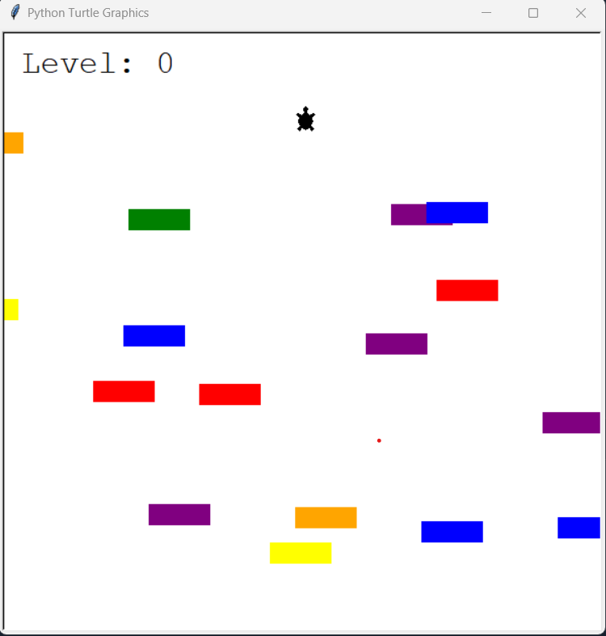
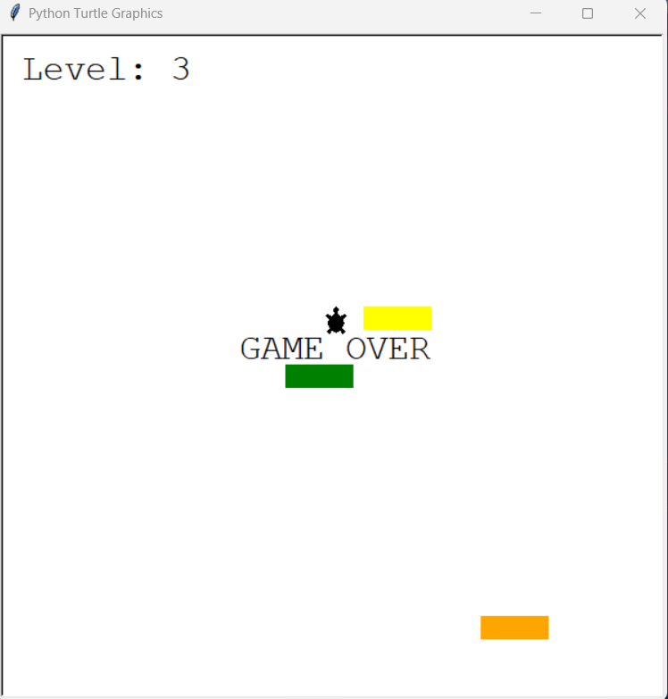

# Turtle Crossing Game
A friendly little game made using `Turtle` and `Screen`.

## How to run
1. Go to the destination folder onterminal
2. Run command `python3 main.py`

## Rules
* You can only move forward
* While not touching any of the bricks, go to the
topmost part of the screen.
* On reaching the top of the screen, you will be upgraded to the next level.
* If you collide with any of the bricks, the game will be over.

## Here are a few images from the game:

